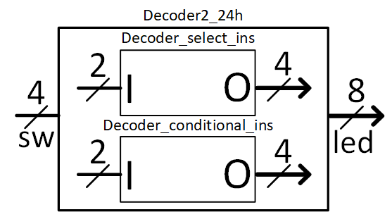
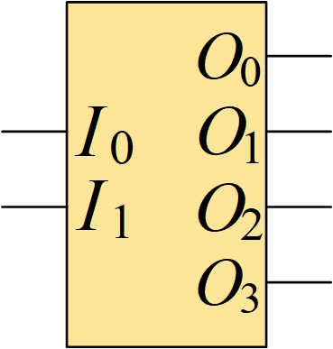
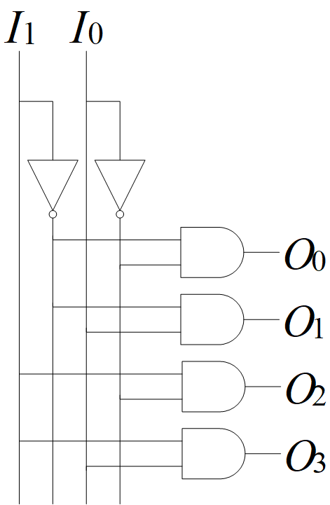

# OVERVIEW
	Hệ thống gồm 2 IC là 2 mạch giải mã 2 đường sang 4 đường, ngõ ra tích cực mức cao.
	Sử dụng lệnh gán tín hiệu có điều kiện và lệnh gán tín hiệu có lựa chọn, mỗi lệnh cho mỗi mạch.
	Thiết kế bằng ngôn ngữ VHDL
	
## Discription
Hệ thống này được thiết kế để tích hợp 2 mạch giải 2 sang 4 vào chung 1 mạch. Chương trình chính Decoder2_24h có 4 tín hiệu ngõ vào là sw (switch), 8 tín hiệu ngõ ra là led sẽ chia đều cho 2 chương trình con là 2 mạch giải mã 2 sang 4: Decoder_conditional_ins và Decoder_select_ins. Sở dĩ có 4 tín hiệu ngõ vào sw là vì sử dụng 2 bit đầu tiên của sw kết nối với 2 tín hiệu ngõ vào I của mạch giải mã thứ nhất (Decoder_select_ins), 2 bit còn lại của sw kết nối với 2 tín hiệu ngõ vào I của mạch giải mã thứ hai (Decoder_conditional_ins). Tương tự ở 8 bit tín hiệu ngõ ra led thì 4 bit led đầu kết nối với 4 bit ngõ ra O của mạch giải mã thứ nhất, 4 bit led còn lại kết nối với 4 bit ngõ ra O của mạch giải mã thứ hai. Ta có thể quan sát được kết quả ở ngõ ra thông qua màu sắc của 8 led dựa trên việc thay đổi trạng thái của 4 cần gạt switch.

## System Block Diagram

## Decoder 2 to 4 Block Diagram

## Truth tabel
	|  Input  |       Output      |
	|    I    |         O         |
	|---------|-------------------|
	| I1 | I0 | O3 | O2 | O1 | O0 |
	|----|----|----|----|----|----|
	| 0  | 0  | 0  | 0  | 0  | 1  |
	| 0  | 1  | 0  | 0  | 1  | 0  |
	| 1  | 0  | 0  | 1  | 0  | 0  |
	| 1  | 1  | 1  | 0  | 0  | 0  |
The logical expressions for the outputs:
	O0 = ~I1 AND ~I0 ;
	O1 = ~I1 AND  I0 ;
	O2 =  I1 AND ~I0 ;
	O3 =  I1 AND  I0 

## Decoder 2 to 4 Circuit Diagram

